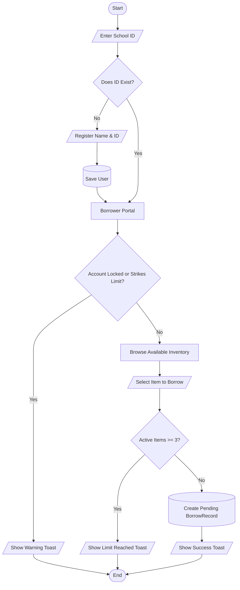
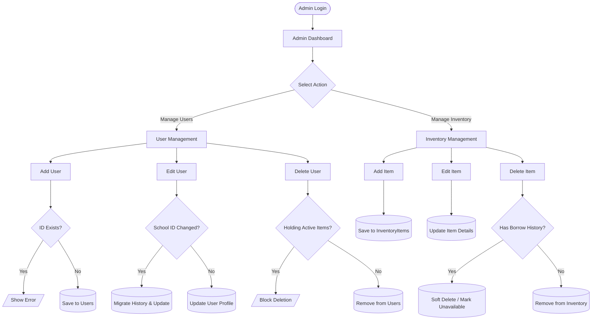
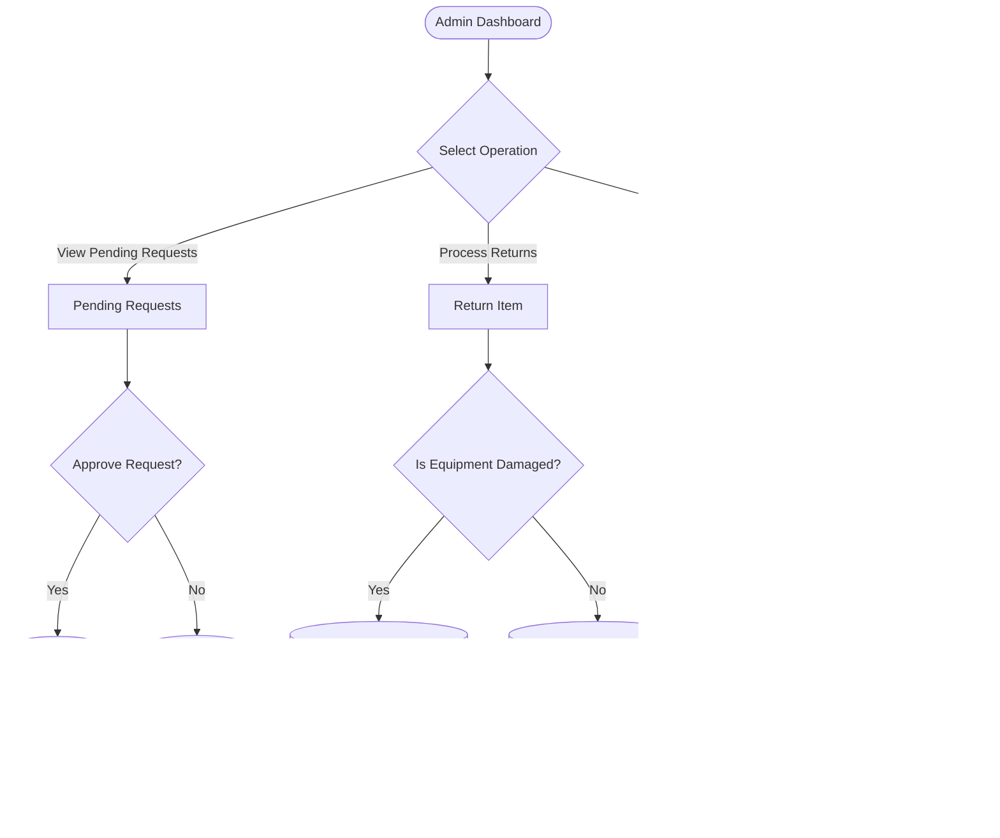
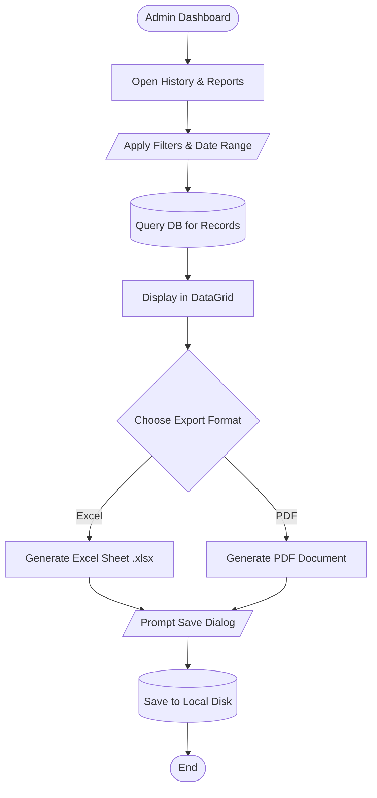

## Application Flowcharts

### 1. The Student Borrowing Process

```mermaid
flowchart TD
    Start([Start]) --> Login[/Enter School ID/]
    
    Login --> UserExists{Does ID Exist?}
    UserExists -- No --> Reg[/Register Name & ID/] --> SaveUser[(Save User)] --> Portal
    UserExists -- Yes --> Portal[Borrower Portal]

    Portal --> CheckStrikes{Account Locked or Strikes Limit?}
    CheckStrikes -- Yes --> Deny1[/Show Warning Toast/] --> End([End])
    CheckStrikes -- No --> ViewInv[Browse Available Inventory]
    
    ViewInv --> Select[/Select Item to Borrow/]
    Select --> CheckLimit{Active Items >= 3?}
    
    CheckLimit -- Yes --> Deny2[/Show Limit Reached Toast/] --> End
    CheckLimit -- No --> SaveReq[(Create Pending BorrowRecord)]
    SaveReq --> Success[/Show Success Toast/] --> End
```

### 2. Admin: User & Inventory Management

```mermaid
flowchart TD
    Start([Admin Login]) --> Dash[Admin Dashboard]
    
    Dash --> Split{Select Action}
    
    %% User Management Branch
    Split -->|Manage Users| M_Users[User Management]
    M_Users --> AddU[Add User] --> CheckUID{ID Exists?}
    CheckUID -- Yes --> ErrU[/Show Error/]
    CheckUID -- No --> SaveU[(Save to Users)]
    
    M_Users --> EditU[Edit User] --> CheckIdChange{School ID Changed?}
    CheckIdChange -- Yes --> Migrate[(Migrate History & Update)]
    CheckIdChange -- No --> UpdateU[(Update User Profile)]
    
    M_Users --> DelU[Delete User] --> CheckUBorrow{Holding Active Items?}
    CheckUBorrow -- Yes --> ErrU2[/Block Deletion/]
    CheckUBorrow -- No --> DropU[(Remove from Users)]

    %% Inventory Management Branch
    Split -->|Manage Inventory| M_Inv[Inventory Management]
    M_Inv --> AddI[Add Item] --> SaveI[(Save to InventoryItems)]
    M_Inv --> EditI[Edit Item] --> UpdateI[(Update Item Details)]
    
    M_Inv --> DelI[Delete Item] --> CheckIHistory{Has Borrow History?}
    CheckIHistory -- Yes --> SoftDel[(Soft Delete / Mark Unavailable)]
    CheckIHistory -- No --> DropI[(Remove from Inventory)]
```

### 3. Admin: Approvals, Returns & Penalties

```mermaid
flowchart TD
    Start([Admin Dashboard]) --> Split{Select Operation}
    
    %% Approvals
    Split -->|View Pending Requests| Pend[Pending Requests]
    Pend --> Approve{Approve Request?}
    Approve -- Yes --> MarkActive[(Status: Active)] --> ItemBrw[(Item: Borrowed)]
    Approve -- No --> Reject[(Delete Request)]
    
    %% Returns & Damages
    Split -->|Process Returns| Ret[Return Item]
    Ret --> CheckCond{Is Equipment Damaged?}
    CheckCond -- Yes --> MarkDamaged[(Status: Returned, Item: Damaged)] --> LogPenalty[Log Manual Repair/Penalty]
    CheckCond -- No --> MarkClean[(Status: Returned, Item: Available)]
    
    %% Overdues
    Split -->|Check Overdues| Overdue[Overdue Processing]
    Overdue --> Calc{Item Active > 7 Days?}
    Calc -- Yes --> MarkOverdue[(Status: Overdue)]
    MarkOverdue --> Strike[(Increment User Strike)]
    Calc -- No --> Skip[No Action]
```

### 4. Admin: Exporting Reports

```mermaid
flowchart TD
    Start([Admin Dashboard]) --> ReportTab[Open History & Reports]
    ReportTab --> Filter[/Apply Filters & Date Range/]
    Filter --> Query[(Query DB for Records)]
    Query --> ShowGrid[Display in DataGrid]
    
    ShowGrid --> Export{Choose Export Format}
    
    Export -- Excel --> GenXL[Generate Excel Sheet .xlsx]
    Export -- PDF --> GenPDF[Generate PDF Document]
    
    GenXL --> PromptSave[/Prompt Save Dialog/]
    GenPDF --> PromptSave
    
    PromptSave --> SaveFile[(Save to Local Disk)] --> End([End])
```
